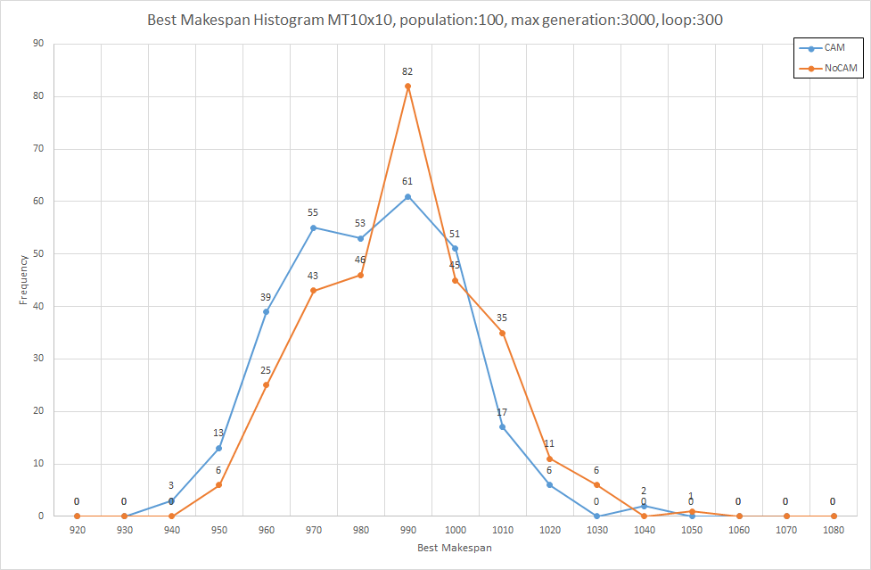

# public-jsp-cam

An unofficial implementation of Genetic Algorithms with Cluster Averaging Method for Solving Job-Shop Scheduling Problems by Python DEAP.

## Overview

This is an unofficial implementation of the [paper(in Japanese)](https://www.jstage.jst.go.jp/article/jjsai/10/5/10_769/_article/-char/ja/) and the [book(in Japanese)](https://www.personal-media.co.jp/book/comp/173/) written by Hiromi Hirano.

## Requirement

* deap 1.3.1
* line\_profiler (if need)

## Usage

### Quick Start

	> git clone git@github.com:shigeta-technoface/public-jsp-cam.git
	> cd public-jsp-cam
	> python main.py

The resulting three log files are in the logs directory.

### Start Options

| name | description | default value | example |
| --- | --- | --- | --- |
| seed | The number of random seed. | 0 | `--seed 0` |
| population | The number of individuals in one population. | 100 | `--population 100` |
| loop | Loop count. | 1 | `--loop 1` |
| processes | The number of worker processes. | `os.cpu_count()`| `--processes 12` |
| logdir | The directory name for log files. | logs | `--logdir ./logs` |
| no\_mp | Use single processing. | Use multi processing. | `--no_mp` |
| no\_cam | Use ordinal replacement. | Use CAM replacement. | `--no_cam` |
| is\_test | Small problem (MT6x6) and 100 generation for development. | MT10x10 and 3000 generation. | `--is_test` |
| do\_perf | Log the application performance. line\_profiler is required. | - | `--do_perf` |

## Output

This program outputs three log files.

| name | description | file name |
|---|---|---|
| root\_log | main log | `%Y%m%d%H%M%S%f_log.log` |
| report\_log | A TSV file that records the best individual for each loop. | `%Y%m%d%H%M%S%f_report.dat` |
| detail\_log | A TSV file that records the best individual for each generation. | `%Y%m%d%H%M%S%f_detail.dat` |

The following histogram was created using two report\_log files. The CAM report\_log is from `python main.py --loop 300` and the NoCAM report\_log from `python main.py --loop 300 --no_cam`.

The following line charts shows the percentiles of the best makespan for each generation.  These were created by using detail\_log file. The CAM detail\_log is from `python main.py --loop 300` and the NoCAM detail\_log from `python main.py --loop 300 --no_cam`.

## Author

<shigeta@technoface.co.jp>

